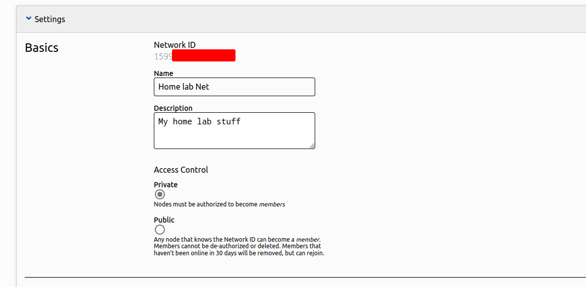
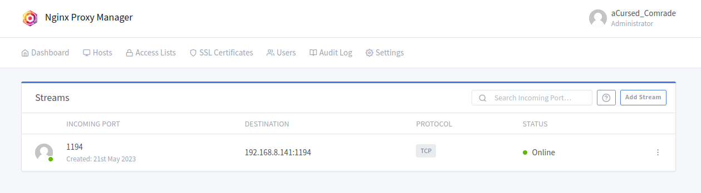

# Home lab on the go

It is a common habit to have your own home lab among many professionals and enthusiasts in the IT field. Whether it is about hosting your content to serve the internet or tinkering with networks and applications, a home lab can be your workplace or your playground. There are different approaches to implement a home lab depending on the resources an individual own. A cloud platform can be used to effortlessly create your assets but with rising cost depending on the scale or by using decent or accessible hardware to set up from scratch in a physical location you can access, like your home.

When implemented, you need to be able to access the lab environment in order to manage assets or to interact with internal services. Cloud platforms provide easy methods to expose and define access controls to your assets that sits on the "edge". When working with your own hardware however, you need to manually integrate your infrastructure and assets with services like site-to-site VPNs or SD-WANs to achieve this goal. In addition, some external factors may affect your implementation. Such as [Carrier-grade NAT (CGNAT)](https://www.a10networks.com/glossary/what-is-carrier-grade-nat-cgn-cgnat/) used by ISPs which doesn't allow peer-to-peer connections. It is possible to allocate a public IP for your infrastructure, but there are alternative technologies that can help you to circumvent limitations of CGNAT.

This blog post covers how I configured secure remote access with my home lab with the help of [**ZeroTier**](https://www.zerotier.com/) and using a forward proxy to assign a domain and define port forwards for internal services. This is a beginner set up which I used to learn much about networking.


This blog is about interconnecting the infrastructure, I won't be covering how to start your own home lab from scratch. However, there are **lots of resources**[^1] to get started out there already. Also, huge kudos to [**@0xBEN**](https://twitter.com/_0xBEN_?s=20) for his resources that helped me get started with mine.


# Connecting the nodes

My home lab layout is based on **[@0xBEN's](https://twitter.com/_0xBEN_?s=20) Proxmox VE guide**[^1] which was used as the foundation for building my home lab, and therefore I will be quoting some content from his blog with his permission to demonstrate the network layout. Before continuing further, below diagram shows our home lab layout:


As of writing this blog post, my home lab layout is similar to what's shown in the diagram except for the absence Wazuh SIEM and dedicated OpenVPN/Wireguard VMs. I may have been distracted while building the home lab, but I have so many plans in mind to tinker around with!


My goal is simple, I need to be able to talk with the following 3 nodes in order to properly work with my homelab:

- **Proxmox hypervisor**: To manage the virtual infrastructure.
- **Virtual pfSense firewall**: In addition to firewall services, this is also used as a OpenVPN server to access VMs on `vmbr1` (Security) vSwitch. Has access to home LAN.
- **A utility VM**: Running bare-bones Arch Linux, my plan is to use this VM to host certain services that I may find useful (discussed later in this post). Has access to home LAN.

0xBEN's guide[^1] showcases the **dynamic DNS** method to set up remote access. But this was not the case for me due to CGNAT limitations on my ISP connection. On my quest for an alternative, I received many suggestions for what I could use to bring my infrastructure together. Here are 4 services (in no particular order) that were suggested mostly:

- [**ZeroTier**](https://www.zerotier.com/)
- [**Tailscale**](https://tailscale.com/)
- [**Defined Networking**](https://www.defined.net/) which uses [**Nebula**](https://github.com/slackhq/nebula) and manages backbone infrastructure for individuals/organizations.
- [**Netmaker**](https://github.com/gravitl/netmaker)

These work almost the same compared to each other with few different features with different underlying spec. These services provide a decent pricing plan with a generous free tier for individual and some services or their underlying frameworks is publicly available that can be self-hosted by capable individuals.

One more important point to highlight is that these services provide different synergies with other services/devices as well. For example, [*pfSense officially support Tailscale*](https://www.netgate.com/blog/tailscale-on-pfsense-software) to bridge "sites" (subnets) together and likewise [*MikroTik's RouterOS supports ZeroTier*](https://help.mikrotik.com/docs/display/ROS/ZeroTier) integration. This can help bridge private networks quick and easily without needing intermediate services or having to manually configure routes. However, for my first run I decided to use **ZeroTier**, and it has been pretty simple to get started and work with.

## ZeroTier

[ZeroTier](https://www.zerotier.com/) combines the capabilities of VPN and SD-WAN to connect all kinds of end user devices to a single virtualized network. The virtual interface created by ZeroTier makes it feel like a regular LAN network where you can manage routes, assign IPs, define flow rules, etc. while providing end-to-end encryption to all traffic.

It is also an open source project (some actions falls under their business license) and the relay server implementation is publicly available for anyone to [*self-host their own instance*](https://docs.zerotier.com/self-hosting/introduction). They also provide a [*development SDK (a socket library)*](https://docs.zerotier.com/sockets/tutorial.html) in a few different programming languages that can be used create and connect embedded applications and systems over the virtual network.

If you want to read more and get started with deployment, make sure to read their [documentation](https://docs.zerotier.com/) and [knowledge base](https://zerotier.atlassian.net/wiki/spaces/SD/overview) for guides and troubleshooting. Now, let's go over the steps you need to set up a ZeroTier network.

- After signing up for an account, you will land on your account dashboard. This page gives you an overview of your active networks and total number of nodes connected. Clicking **"Create a Network"** will create a new network entry on the dashboard with a random name. To continue, click on the new record to open the network configuration page.


- There are subsections for help regarding each option you see in this configuration page. Make sure to refer that if you have any doubts about a component.
- The basic settings section can be used to customize the name, description and the level of access control of your network. **Private** mode creates an additional authorization step which has to be approved by a network administrator before a node is allowed to communicate with the network.



- The advanced settings section contains network related options that you can configure according to your needs.
  - **Managed Routes** dialogue can be used to manually add routes through the connected nodes. Additional configuration on the target node is required to make this work.
  - **IPv4 Auto Assign** dialogue lets you define a IPv4 private address range ([RFC 1918](https://datatracker.ietf.org/doc/html/rfc1918)) that will be used to automatically allocated addresses to connecting nodes. You may want to **double-check your allocation** with your LAN or other networks that might overlap and cause issues with routing.
  - **IPv6 Auto Assign** dialogue works the same as IPv4.
  - **Multicast** dialogue lets you configure multicast recipient limit and enable broadcast within the network.
  - **DNS** dialogue lets you define an internal domain for the network and assign a DNS server node.
  - **Manually Add Member** dialogue lets you authenticate a node before it joins a network (or to unban a previously banned node).


- Heading over to **Members** section after configuring your settings, you will see a floating about adding new members. You should now [download and install](https://www.zerotier.com/download/) the client application to the devices you need (You will need administrative privileges when working with ZeroTier client). Assuming you are on a Linux distribution, you can try the below command on your terminal to test the CLI tool:

```bash
# To print help text
sudo zerotier-cli help
```

```bash
# To view your client info
sudo zerotier-cli info
```
- The client info command returns your **client ID** and service status, client ID (or member ID) is used to uniquely identify nodes when adding/removing from the network. We should now join our node to the virtual network with the **network ID** that is shown in the dashboard or in the network management page.

```bash
# To join a network
sudo zerotier-cli join NETWORK_ID
```

```bash
# To list active network status
sudo zerotier-cli listnetworks
```
- Assuming you have chosen to keep the network **private** in the configuration stage, the status of the previous command will be "ACCESS DENIED" because you need to approve the node before it can start communicating over the network. Head over to the **Members** section we previously left before, you should now see a new record with the **client ID** of the node you are working with. Check the field on the "Auth" column to approve the node.


- If everything went accordingly, your node will be assigned an IP address from the range you previously configured. Use the `listnetwork` command in the CLI tool to verify. The service also configures a virtual network interface for the node which you can see with `ip a` command.

You should now repeat above steps on the nodes which you need to add to the network. The daemon installed with the service makes sure that every time a node reboots, the virtual interface will be brought back up again. All you need is to be able to connect and talk to ZeroTier or your own relay server over the internet, then you just treat it like usual LAN connection.

## Virtual network overview


Going back to my home lab setup, I connected my Proxmox node, utility VM, my personal laptop and my mobile to the network. The remaining node is the pfSense firewall but the reason I cannot connect it is that it may cause issues with the firewall config and my lack of knowledge on the BSD ecosystem. Even though I have listed about how to forward these internal services, another approach would be to have the firewall connected directly connected with our SD-WAN solution, so we can directly bridge internal subnets via the firewall without any intermediate forwarding or other solutions (I included a few examples in a previous section).


I initially used the Proxmox node as a proxy (*by using the `ssh -R` option to create a reverse socks proxy*) to access pfSense web panel and its OpenVPN server. It is a working alternative but in the next section I will write about how forward proxies can be used AND how we can assign a verifiable domain with the help of certain project.

# A forwarding proxy

At this point, my attention went towards [**Nginx**](https://nginx.org/en/) as this is a perfect scenario to set it up on the utility VM. It can act as a reverse proxy to serve internal services or forward TCP/UDP connections to internal services. But we still need a DNS or domain service to make it easier to access web content.

This is when I found a nice video[^2] that covers [**Nginx proxy manager project**](https://nginxproxymanager.com/) which can streamline the usage of nginx and easily assign a domain with verifiable security (SSL) including to hosts which are not exposed to the internet. I recommend watching the video for detailed steps, and my changes to its configuration is listed below.

[](https://youtu.be/qlcVx-k-02E)

## Nginx Proxy Manager

- For the domain, I have selected `comradenet.duckdns.org` (*that's pretty long domain name*) and pointed IP at the **ZeroTier assigned address** `172.27.10.11` of the utility VM.
- After setting up docker and docker-compose on the VM, I took the `docker-compose` file in the quick setup page and added an extra mapping to port `1194` which is the default port for OpenVPN servers.

```dockerfile
version: '3.8'
services:
  nginxproxymanager:
    image: 'jc21/nginx-proxy-manager:latest'
    restart: unless-stopped
    ports:
      - '80:80'
      - '81:81'
      - '443:443'
      - '1194:1194'
    volumes:
      - ./data:/data
      - ./letsencrypt:/etc/letsencrypt
```
- After spinning up the container and going through the initial login setup, I created a wildcard SSL certificate as described in the video.


- Moving on to proxy host configuration, the process is same as seen in the video. After defining two subdomains for Proxmox and pfSense, the destination is pointed towards their **LAN addresses**. One additional detail is that we need to enable **Websocket support** on both proxy records for the web panels to work correctly (This is the case for Proxmox and pfSense web panels, other web services may differ).


- And finally, I defined a stream record to forward all incoming traffic on port `1194` to the same port on pfSense firewall via the LAN. With that, I just need to define the target server on the OpenVPN client config as the utility VM and the proxy will forward the traffic to pfSense server. TCP forwarding is selected as the OpenVPN server is configured to use TCP instead of UDP.



And that's the proxy manager configuration for my environment. You may need to define additional port mappings depending on what you are trying to proxy or set up forwarding. You are free to stop and scrap the container when you want to modify port mappings as all the data is stored in mounts as defined in the `docker-compose` file. Make sure to organize those folders (mounts) properly on your docker host, so your configuration is not lost.

## Proxy in action

Now I can easily access my web panels by using a nice *little* URL on my browser and join my internal VPN to play around with my cyber playground as long as I am connected to my ZeroTier network.


Nginx proxy manager has been pretty helpful to me as a beginner. The GUI has more options available inline with what Nginx has to offer, but one might need to manually configure their Nginx instance to fine tune all the options it has to offer.

# Concluding thoughts

And that's about it for my home lab adventure. This has been a nice learning experience for me when it comes to network implementation and technologies behind them. I am planning try out more services as listed in this post to come up with a better network design that is easy to use and maintain. The industry certainly has much more to offer, and this post only covered a few of them.

I would like to thank [**@0xBEN**](https://twitter.com/_0xBEN_?s=20) again for his awesome resources that got me interested in tinkering as well. And thank you for reading my post **o7**, hope you enjoyed and possibly gained something from my post.

# References

[^1]: [Proxmox VE 7: Converting a Laptop into a Bare Metal Server by 0xBEN](https://benheater.com/bare-metal-proxmox-laptop/)

[^2]: [Setting up a reverse proxy and SSL for your home lab](https://youtu.be/qlcVx-k-02E)
