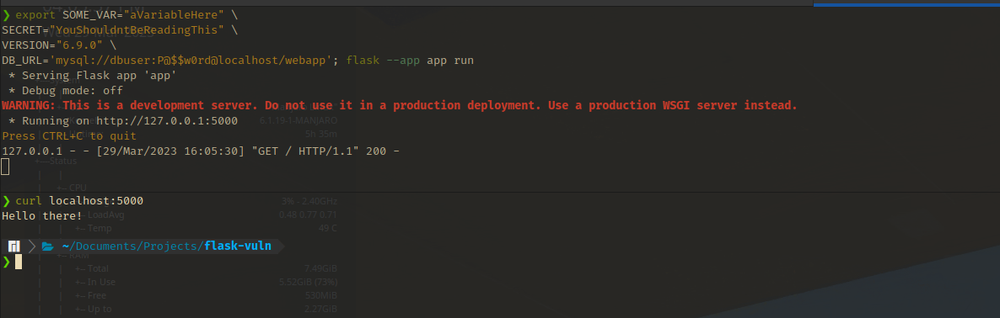
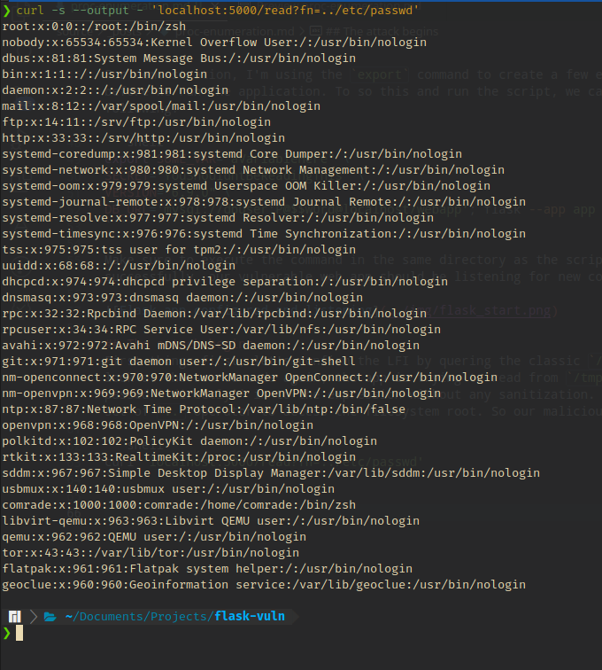
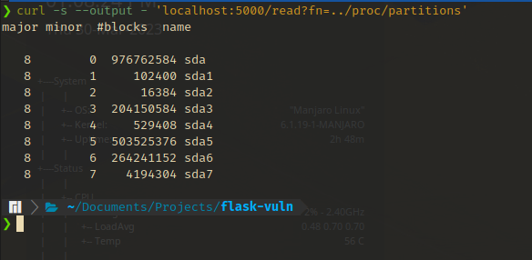
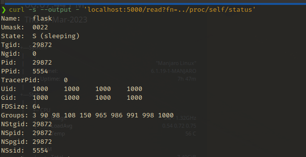
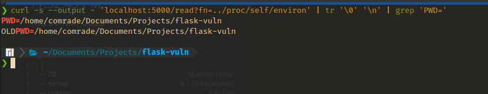

# What is "/proc"?

The `proc` file system, which usually lies in `/proc` directory of a Linux system, contains information about the runtime of the system and all processes on the system. This information is stored in the form of files or file-like objects which can be read from using simple text readers such `cat` or `grep` and can be modified by high-privileged users and processes for different purposes.

If let's say a vulnerability like **LFI (Local File Inclusion)**, **command injection** or similar exists on a web app, which provides an attacker with read access on the target system. This exposes the `/proc` file system and most likely sensitive information alongside of it. This is something I can personally relate to when solving CTF machines.

# A little scenario

Throughout this post, I will be using a small **python Flask** app that is deliberately vulnerable to an LFI to demonstrate the attack vector. The code for the web app is given below, make sure to run it in a contained environment:

```python
from flask import Flask, request
app = Flask(__name__)

@app.route('/')
def index():
  return 'Hello there!\n'

@app.route('/read')
def read():
  file = request.args.get('fn')
  with open(f'/tmp/{file}', 'rb') as f: # Classic LFI
    data = f.read()
    return data

if __name__ == '__main__':
  app.run()
```

If you haven't already installed the **Flask** library, you can do so by executing the command:

```bash
pip install Flask
```

For demonstration, I'm using the `export` command to create a few environment variables before we run the application. To do this and run the script, we can execute the following:

```bash
export SOME_VAR="aVariableHere" \
SECRET="YouShouldntBeReadingThis" \
VERSION="6.9.0" \
DB_URL='mysql://dbuser:P@$$w0rd@localhost/webapp'; flask --app app run
```

Make sure to execute the command in the same directory as the script. If executed successfully, our vulnerable web app should be listening for new connections.



# The attack begins

First things first, let's confirm the LFI by querying the classic `/etc/passwd`. If we look at the source code again, the app is trying to read from `/tmp` with the filename passed **directly** in to the expression without any sanitation. We only need a single `..` operator to access the file system root. So our malicious query will be:

```bash
curl 'localhost:5000/read?fn=../etc/passwd'
```



Great! (or not so great *wink*) This means that we can now read all files in the system which can be read by the system account running the web app. An attacker can now try to read various configuration files that are presumably on default locations (on the file system) or other files of interest and gather as much as information to gain a foothold.

## "/proc" structure

- You can break down the entries into two major categories. One is **kernel (or system) information** and the other is **process specific information**.
- The numbered directories you see are made for each process, thus containing process information. The number represents the process ID (PID) of each individual process.
- The remaining directories and file-like objects contains kernel information (but there are 4 interesting exceptions which will be discussed below).
- Another interesting fact is that `/proc` **occupies no disk space at all (or at least a very minimal amount)**, the kernel (or the system) generates the necessary information dynamically when programs access specific entries within `/proc`.
- Except for a few entries, the contents of `/proc` are globally readable. But as an attacker, we only have to look at a few interesting entries.



This post will go over some entries briefly. You can read the complete documentation for the `/proc` file system and its entries from the **Linux documentation** or **man pages** (see references) in your own terminal. More links are available at the end of the post.



In this scenario, we are using an LFI vulnerability to read files off the system. We can read **entries (files or file-like objects)** in `/proc` and in other parts of the file system, but we cannot read **directories** which is the expected behavior. However, a capable attacker can automate a brute-force attack with a list of possible file/directory names to discover files in the file system.


## Kernel information

- `/proc/cpuinfo`
  - Returns information regarding individual CPU cores available to the system. (Response can be quite long depending on the number of cores)


- `/proc/meminfo`
  - Returns information about the system memory. This includes total memory, used memory, free memory, etc.


- `/proc/version`
  - Returns the kernel version information.


- `/proc/partitions`
  - Returns the partition table known to the system.



As mentioned in [/proc structure](#proc-structure), there are few interesting links that are available within `/proc`. Simply, they are ***magical*** links that automatically points to the process directory of the current process. They are listed below:

- `/proc/self`
  - This is a *magical* link that automatically points to the relevant `/proc/<PID>/` **directories** of the processes that are currently accessing the entry. This was introduced as a convenient way of accessing own process information. Thus, it can be easily used in attacks such as LFI to quickly expose information about the current process without having to know the PID.

- `/proc/mounts`
  - Like `/proc/self`, this link points to the `/proc/<PID>/mounts` entry of the own process. This contains information about the file system mounts that are accessible by the process (Refer `/proc/mounts` in man pages). This can include network shares that are mounted on the system.
  - For example, below you can see a mount that is created by [KDE Connect](https://kdeconnect.kde.org/) that is exposing some folders in my android device. In the next screenshot, I'm accessing the `Documents/message.txt` within that share which is an example of information disclosure.


- `/proc/net/`
  - Like `/proc/mounts`, this link points to the `/proc/<PID>/net/` **directory** of the own process. The entries within this directory hold different kinds of information about the networking stack that is accessible by the process (Refer `/proc/net` in man pages).
  - For example, the `arp` entry holds the ARP cache of the system which can be used to discover internal hosts of the network and interface names that are useful to know in some cases. `tcp` and `udp` entries have relevant connections that are established or listening on the system (in hex format).


- `/proc/threads-self`
  - Like the above magic links, this points to the relevant `/proc/<PID>/task/<TID>/` **(process thread) directory** of the own process, if it is being accessed by a thread. The TID here is similar to a PID and threads are accessible via `/proc/<TID>` as well. However, threads are different from processes in computing.


## Process information


In this scenario, we can use the `/proc/self/` link to expose information about the web app process without guessing the PID. But it is possible to brute-force PID to find processes of interest.


- `/proc/<PID>/comm` & `/proc/<PID>/cmdline`
  - `comm` and `cmdline` hold the base name of the command and the complete command (with arguments) used to execute the command respectively. `cmdline` will spit out the command with the spaces in between arguments replaced by a null byte '\0'. We can pass this through a replace function to restore the spaces. What's important here is that the command line arguments can contain passwords (This is bad practice).


- `/proc/<PID>/status`
  - This entry contains an array of different kinds of information. `Name`, `Pid`, `PPid` (Parent PID), `Uid` (Effective user ID), `Gid` (Effective group ID) and `Groups` (Groups the process belongs to) are some important fields out of it for enumeration.



- `/proc/<PID>/environ`
  - This is the **most important one** in my opinion. This holds the *initial* environment variables that was used to execute the process with. By initial, it means that if any changes happen to these variables during the process lifetime, it won't be reflected here.
  - Often in production and in development, environment variables are used to hold configuration information and usually contain sensitive information like secret keys, authentication tokens, database credentials, etc.
  - For example, here we've dumped our dummy variables that we set up earlier (the newlines '\n' are replaces by null bytes '\0' here as well) (I have also truncated the output to remove any unnecessary variables from my ZSH config).


- `/proc/<PID>/cwd/`
  - This is a symbolic link that points to the **current working directory** of the process. Can sometimes be used as a shortcut in the context of the web app path on the file system. The PWD variable can be extracted from `/proc/<PID>/environ` to figure out what is the current working directory.




- `/proc/<PID>/exe`
  - This entry points directly to the executable command that is used run the command. Reading this will output raw binary data. Useful when you are dealing with custom standalone binaries during challenges, and you want to extract them for analysis and reversing.


- `/proc/<PID>/fd/`
  - This **directory** contains symbolic links to each file that is open in the process, named using numbers (Numbers correlate to the entries in the `fdinfo/` directory). Except the first three; 0, 1, 2 which are stdin, stdout and stderr respectively, files can be queried to view thier contents which may contain important information. Sometimes it can be used to execute code in the context of the web app (see references).


# Concluding thoughts

That's about it for my first blog post :) This post covered a few interesting locations in the Linux `/proc` file system that an attacker with some read access on the system during initial compromise or even during post exploitation phase can enumerate to uncover information. You can refer the links in the below sections for more information about the topic.

But this is a small part of an attack chain. Depending on the context of the scenario, an attacker will think outside box to carry out the attack chain and compromise a system. **YOU** should think out of the box too.

Thank you for reading **o7**


# Extra reading

- [Linux enumeration with read access only](https://idafchev.github.io/enumeration/2018/03/05/linux_proc_enum.html)
- [Directory Traversal, File Inclusion, and The Proc File System](https://www.netspi.com/blog/technical/web-application-penetration-testing/directory-traversal-file-inclusion-proc-file-system/)

# References


<br>

<br>
{% button https://github.com/swisskyrepo/PayloadsAllTheThings/blob/master/File%20Inclusion/README.md#lfi-to-rce-via-procfd, LFI to RCE via /proc/*/fd, globe fa-fw fa-lg %}
